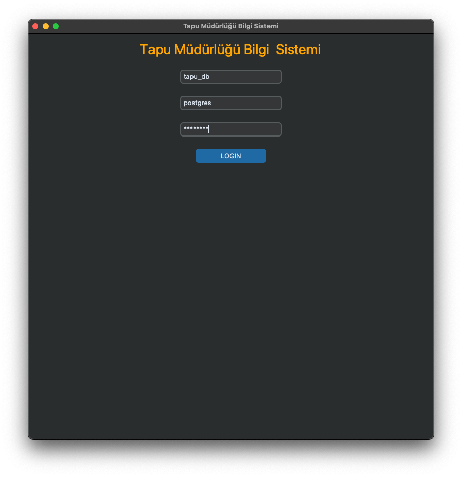
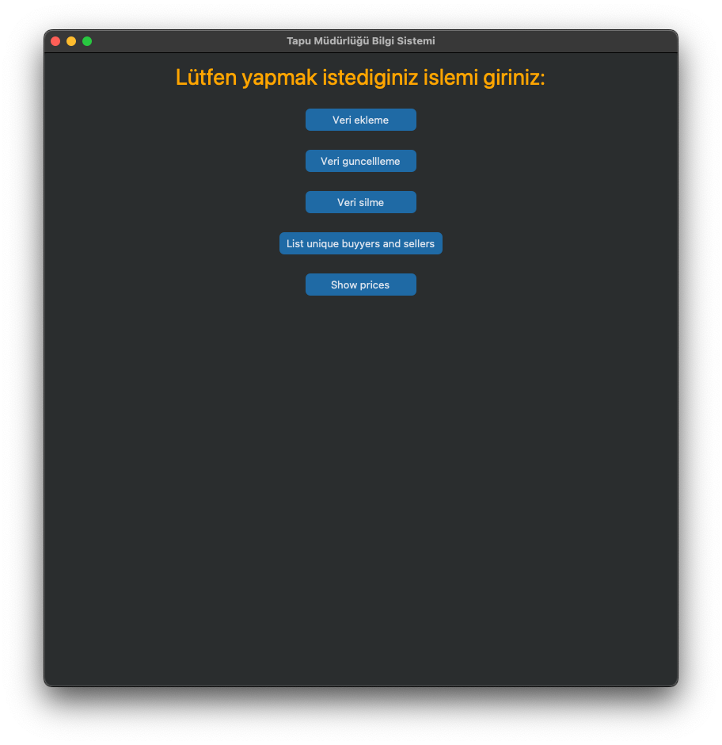

# tapu_db
Veritabanı projesi: Tapu Müdürlüğü Bilgi Sistemi

### Figures




### Filesystem
```bash
├── LICENSE
├── README.md
├── database
│   ├── tapu_db_data.sql
│   ├── tapu_db_queries.sql
│   └── tapu_db_schema.sql
├── figures
│   ├── giris.png
│   ├── options.png
│   ├── ornek_sorgu.png
│   └── ornek_sorgu_2.png
├── project.pdf
├── requirements.txt
└── scripts
    └── gui.py
```

### Installation
First of all check that how can you install related modules can be installed to your system.
Following script may not work!

```bash
pip3 install -r requirements.txt
```

### How to Run

##### Step-1
It is need to be create a database as "tapu_db" with PostgreSQL.

##### Step-2
Run prepared sql files in tapu_db with specific order as following;

- 1.tapu_db_schema.sql
- 2.tapu_db_data.sql

##### Step-3
And now, it is time to run example queries.
Run tapu_db_queries.sql step by step to see the datas.

##### Step-4
Change PostgreSQL password according to your system.

```bash
python3 gui.py
```